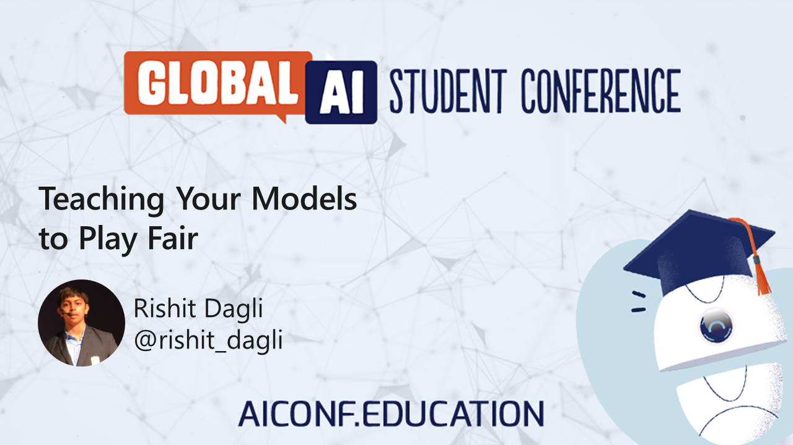

# Global AI Student Conference

My session at Microsoft Global AI Student Conference about **Teaching your Models to play fair** , 12 
December 2020.

## [Event announcement](https://aiconf.education/)

# Global AI Community Mumbai

My session at [Global AI Community Mumbai](https://www.meetup.com/Global-AI-Community-Mumbai/) about **Teaching your Models to play fair** at Global AI On Tour Mumbai, 27 
September 2020. Special Thanks to [@ialimustufa](ialimustufa), [@adityaoberai](https://github.com/adityaoberai), [@gat786](https://github.com/gat786), Manish Kaushik and 
[@nsayali](https://github.com/nsayali) for hosting me.

## [Event announcement](http://bit.ly/aiontour-reg)

## [Tweet](https://twitter.com/nsayali_/status/1305902340575080448?s=20)
